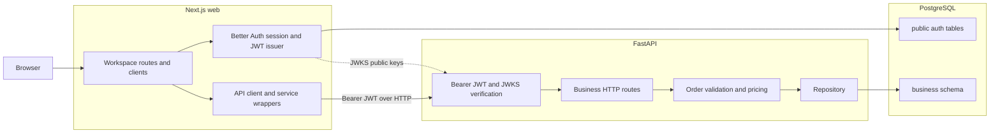

# VentIA application architecture spike

This directory records a source-based architecture walkthrough. Each numbered slice is independently readable and follows a bounded part of the application. The reports describe current behavior; open questions are observations, not implementation decisions. No application code or runtime was changed as part of this spike.

## Slice reports

| Slice | Area | Report |
| --- | --- | --- |
| 01 | Runtime and startup topology | [01-runtime-startup.md](01-runtime-startup.md) |
| 02 | Web shell and session | [02-web-shell-session.md](02-web-shell-session.md) |
| 03 | Conversation inbox | [03-inbox.md](03-inbox.md) |
| 04 | Web-to-API client and token transport | [04-web-api-client.md](04-web-api-client.md) |
| 05 | API boundary and identity | [05-api-identity.md](05-api-identity.md) |
| 06 | Business API and persistence | [06-business-api-persistence.md](06-business-api-persistence.md) |
| 07 | Saved-order UI | [07-saved-order-ui.md](07-saved-order-ui.md) |

Each report includes its entry points, current flow, contracts and ownership, failure states, verification seams, and unresolved questions. The slices can be reviewed in any order; the map below connects their boundaries without making one report a prerequisite for another.

## Architecture map

The local Compose setup starts PostgreSQL, initializes Better Auth, migrates and seeds the API's business schema, then starts the web app. Better Auth and the API use the same PostgreSQL server but own different table areas. The browser calls the API directly using `NEXT_PUBLIC_API_URL`; the Next.js server layout separately checks the Better Auth session before rendering workspace pages.

## Cross-slice request paths

### Existing inbox read

`/workspace` passes through the authenticated workspace layout, then renders `InboxClient`. The client gets a JWT, calls the shared API client and `GET /sample-conversations`, and renders the returned sample record as a searchable list and read-only thread. The inbox owns selection state. Its existing `onConversationChange` and `headerActions` props are candidate integration seams for a future flow.

### Existing saved-order read

The list and detail routes render `OrdersClient`. It obtains a JWT and calls `GET /orders` or `GET /orders/{id}`. The API scopes results to the JWT subject; the UI formats the returned order snapshot and supports refresh, search, empty, and error states.

### Existing order write boundary

The API already accepts `POST /orders`. It validates customer name, address, product IDs, and positive integer quantities; derives prices and totals from the catalog; then persists an order owned by the authenticated user. The endpoint is not idempotent, and no AI proposal/review UI or model-backed API operation was found in the current feature path.

## Findings relevant to a future feature

- The conversation callback exposes the selected full sample record, including the original `text`. The `customer_name` is display context and is not a substitute for interpreting and reviewing name/address fields from the conversation.
- The order-create API accepts only reviewed order inputs and treats catalog prices as authoritative. The client must not supply prices or invented product IDs.
- The README requires model credentials to stay server-side. Compose passes optional provider credentials to the API container, while browser UI code is public; the future model call therefore needs a server-side boundary. The current spike does not choose whether that boundary is a new FastAPI operation or another server-side route.
- Changing the selected conversation while a proposal is in progress needs an explicit stale-proposal policy. The README says not to silently mix a proposal with a newly selected conversation and says incomplete proposals must remain editable.
- After a successful write, the existing UI can navigate to `/workspace/orders/{id}`. The product flow still needs to choose its confirmation/navigation behavior.

## What was and was not verified

The reports were produced by reading source, tests, configuration, and the README. Existing tests are listed as verification seams, but were not run. No containers or browser session were started, so runtime readiness, visual layout, and live auth/model connectivity remain unverified. The reports contain suggested checks for those boundaries.
